# 🚀 Stellar Ignition System (SIS)

A sophisticated rocket launch control system featuring WiFi-based remote control, real-time monitoring, and automated countdown sequences. Built with ESP32 and Arduino UNO for reliable and safe rocket/firework ignition control.


[](https://opensource.org/licenses/MIT)
[](https://www.arduino.cc/)
[](https://www.espressif.com/)

## 🎯 Overview

The Stellar Ignition System is a dual-microcontroller rocket launch control system designed for safe and reliable remote ignition of model rockets or fireworks. The system combines an ESP32 for WiFi connectivity and web interface with an Arduino UNO for precise countdown timing and ignition control.

### Key Components
- **ESP32**: WiFi Access Point, Web Server, Remote Control Interface
- **Arduino UNO**: Countdown Logic, Buzzer Control, Fuse Ignition
- **Web Dashboard**: Real-time monitoring and launch control

## ✨ Features

### 🌐 WiFi Control System (ESP32)
- **Dedicated Access Point**: Creates "Launch-Control-AP" network
- **Responsive Web Interface**: Modern, mobile-friendly dashboard
- **Real-time Status Monitoring**: Live system updates and telemetry
- **Secure Access Control**: Password-protected network access
- **Multi-device Support**: Monitor connected clients

### ⏰ Launch Control System (Arduino)
- **3-Phase Countdown**: Sophisticated timing sequence
- **Audio Feedback**: Multi-tone buzzer system
- **Fuse Control**: PWM-based ignition trigger
- **Serial Monitoring**: Detailed launch sequence logging

### 🔒 Safety Features
- **Arm/Disarm System**: Prevents accidental launches
- **Confirmation Dialogs**: Double-confirmation for launch commands
- **Status LEDs**: Visual system state indicators
- **Timeout Protection**: Automatic safety timeouts
- **Signal Debouncing**: Hardware noise filtering

## 🏗️ System Architecture


### Communication Flow

```mermaid
sequenceDiagram
    participant U as User Interface
    participant E as ESP32
    participant A as Arduino UNO
    participant H as Hardware
    
    U->>E: Launch Request
    E->>E: Validate System Armed
    E->>A: Send Trigger Signal (Pin 4→7)
    A->>A: Begin Countdown Sequence
    
    loop Phase 1: Normal Countdown (10-6)
        A->>H: Buzzer Tone (800Hz, 500ms)
        A->>A: Wait 1 second
    end
    
    loop Phase 2: Accelerated (5-1)
        A->>H: Buzzer Tone (1200Hz, 300ms)
        A->>A: Wait 600ms
    end
    
    loop Phase 3: Final Sequence
        A->>H: Rapid Beeps (1500Hz, 150ms)
        A->>A: Wait 200ms
    end
    
    A->>H: LAUNCH! Activate Fuse (3 seconds)
    A->>H: Buzzer (2000Hz continuous)
    A->>H: PWM Signal (255/255 duty cycle)
    A->>A: Sequence Complete
```



## 🔧 Hardware Requirements

### ESP32 Development Board
- **Model**: ESP32 DevKit v1 or similar
- **Features**: WiFi, 2.4GHz, 240MHz dual-core
- **Pins Used**:
  - Pin 4: Output to Arduino (Trigger)
  - Pin 16: Status LED
  - Pin 17: System LED

### Arduino UNO
- **Model**: Arduino UNO R3 or compatible
- **Pins Used**:
  - Pin 7: Input from ESP32 (with internal pull-up)
  - Pin 9: PWM output for fuse trigger
  - Pin 13: Buzzer output

### Additional Components

| Component | Quantity | Purpose |
|-----------|----------|---------|
| Buzzer/Speaker | 1 | Audio countdown feedback |
| LEDs | 2 | Status indicators |
| Resistors (220Ω) | 2 | LED current limiting |
| Breadboard/PCB | 1 | Circuit assembly |
| Jumper Wires | 10+ | Connections |
| Power Supply | 2 | ESP32 (5V) & Arduino (9V) |

## 📐 Wiring Diagram

```
ESP32 DevKit                    Arduino UNO
┌─────────────┐                ┌─────────────┐
│    Pin 4    ├────────────────┤    Pin 7    │ (Trigger Signal)
│   Pin 16    ├────[220Ω]──LED │             │ (Status LED)
│   Pin 17    ├────[220Ω]──LED │   Pin 13    ├──── Buzzer
│    GND      ├────────────────┤    GND      │
│    VCC      │                │   Pin 9     ├──── Fuse Trigger
└─────────────┘                └─────────────┘
```

### Pin Configuration Details

#### ESP32 Pin Assignments
```cpp
const int triggerPin = 4;    // Output to Arduino Pin 7
const int statusLED = 16;    // System heartbeat LED
const int systemLED = 17;    // Armed/Disarmed indicator
```

#### Arduino Pin Assignments
```cpp
const int buzzerPin = 13;    // Buzzer/Speaker output
const int triggerPin = 7;    // Input from ESP32 (INPUT_PULLUP)
const int fusePin = 9;       // PWM output for fuse ignition
```

## 💾 Software Installation

### Prerequisites
- Arduino IDE 1.8+ or Arduino IDE 2.0+
- ESP32 Board Package
- Required Libraries

### Library Dependencies

#### For ESP32:
```cpp
#include <WiFi.h>          // Built-in ESP32 WiFi
#include <WebServer.h>     // Built-in ESP32 Web Server
#include <ArduinoJson.h>   // JSON handling for API
#include <SPIFFS.h>        // File system (optional)
```

#### For Arduino UNO:
```cpp
// Uses only built-in Arduino libraries
// No external dependencies required
```

### Installation Steps

1. **Install ESP32 Board Package**
   ```
   File → Preferences → Additional Board Manager URLs
   Add: https://dl.espressif.com/dl/package_esp32_index.json
   Tools → Board Manager → Search "ESP32" → Install
   ```

2. **Install ArduinoJson Library**
   ```
   Tools → Manage Libraries → Search "ArduinoJson" → Install
   ```

3. **Upload Code**
   - Flash `SIS-ESP32.ino` to ESP32
   - Flash `SIS-UNO.ino` to Arduino UNO

4. **Network Configuration**
   ```cpp
   const char* ssid = "Launch-Control-AP";
   const char* password = "sis@2025";
   ```

## 📁 Code Structure

### ESP32 Code Architecture (`SIS-ESP32.ino`)

```
SIS-ESP32.ino
├── Setup & Configuration
│   ├── WiFi Access Point Setup
│   ├── Web Server Initialization  
│   ├── Pin Configuration
│   └── System Status Setup
│
├── Main Loop
│   ├── HTTP Request Handling
│   ├── Status Updates
│   └── Heartbeat LED Management
│
├── Web Server Handlers
│   ├── handleRoot() - Dashboard HTML
│   ├── handleGetStatus() - System Status API
│   ├── handleLaunch() - Launch Command API
│   ├── handleArmSystem() - Arm System API
│   └── handleDisarmSystem() - Disarm System API
│
└── Utility Functions
    ├── triggerLaunch() - Arduino Communication
    ├── updateSystemStatus() - Status Management
    ├── formatUptime() - Time Formatting
    └── formatTime() - Timestamp Formatting
```

### Arduino Code Architecture (`SIS-UNO.ino`)

```
SIS-UNO.ino
├── Setup & Configuration
│   ├── Serial Communication (9600 baud)
│   ├── Pin Mode Configuration
│   └── Initial Status Display
│
├── Main Loop
│   ├── Trigger Signal Monitoring
│   ├── Launch Sequence Activation
│   └── System Standby Mode
│
└── Launch Sequence Function
    ├── Phase 1: Normal Countdown (10-6 seconds)
    ├── Phase 2: Accelerated Countdown (5-1 seconds)
    ├── Phase 3: Final Rapid Sequence
    └── Ignition Activation (3-second fuse trigger)
```

## 🖥️ Web Interface

### Dashboard Features

#### Status Grid
- **System Status**: Armed/Disarmed state with color coding
- **Connected Clients**: Number of devices connected to AP
- **Total Launches**: Cumulative launch counter
- **System Uptime**: Hours:Minutes:Seconds format
- **Last Launch**: Time since last launch attempt
- **Signal Strength**: Network quality indicator

#### Control Panel
- **Arm/Disarm Buttons**: System safety controls
- **Launch Button**: Primary ignition trigger
- **Confirmation Dialog**: Safety confirmation for launches
- **Status Indicators**: Visual feedback for all operations

#### System Log
- **Real-time Logging**: Timestamped event tracking
- **Color-coded Messages**: Info, Warning, Error, Success
- **Scrollable History**: Last 50 system events
- **Automatic Updates**: 1-second refresh interval

### CSS Styling Features
- **Cyberpunk Theme**: Dark background with neon accents
- **Responsive Design**: Mobile and desktop compatible
- **Animations**: Glowing effects and smooth transitions
- **Status Colors**: Green (armed), Red (disarmed), Orange (launching)

## 🔌 API Reference

### Base URL
```
http://192.168.4.1
```

### Endpoints

#### GET /api/status
Returns current system status
```json
{
  "armed": true,
  "launching": false,
  "clients": 2,
  "totalLaunches": 5,
  "uptime": "01:23:45",
  "lastLaunch": "2m ago",
  "signalStrength": "Excellent"
}
```

#### POST /api/launch
Initiates launch sequence
```json
// Request: Empty body
// Response:
{
  "success": true,
  "message": "Launch sequence initiated"
}
```

#### POST /api/arm
Arms the launch system
```json
{
  "success": true,
  "message": "System armed"
}
```

#### POST /api/disarm
Disarms the launch system
```json
{
  "success": true,
  "message": "System disarmed"
}
```

### Error Responses
```json
{
  "success": false,
  "message": "System not armed"
}
```

## 🔒 Safety Features

### Multi-Layer Safety System

1. **Software Safeguards**
   - Arm/Disarm state validation
   - Confirmation dialogs for critical actions
   - Launch-in-progress prevention
   - Timeout-based automatic resets

2. **Hardware Safeguards**
   - Pull-up resistor configuration for noise immunity
   - Signal debouncing in trigger detection
   - Separate power supplies for isolation
   - Visual status indicators

3. **Network Security**
   - WPA2 password protection
   - Local network isolation
   - No internet connectivity requirement

### Safety Protocols

#### Pre-Launch Checklist
1. ✅ Verify all connections are secure
2. ✅ Confirm safe launch environment
3. ✅ Arm system via web interface
4. ✅ Double-confirm launch command
5. ✅ Monitor countdown sequence

#### Emergency Procedures
- **Power Disconnection**: Primary safety method
- **System Disarm**: Web interface emergency stop
- **Physical Isolation**: Disconnect ignition wires

## 📖 Usage Instructions

### Initial Setup

1. **Hardware Assembly**
   ```bash
   1. Connect ESP32 Pin 4 to Arduino Pin 7
   2. Connect both GND pins together
   3. Attach buzzer to Arduino Pin 13
   4. Connect ignition system to Arduino Pin 9
   5. Install status LEDs on ESP32 Pins 16 & 17
   ```

2. **Power On Sequence**
   ```bash
   1. Power Arduino UNO first
   2. Power ESP32 second
   3. Wait for WiFi AP to initialize (30 seconds)
   4. Connect device to "Launch-Control-AP"
   ```

3. **Web Interface Access**
   ```bash
   1. Open web browser
   2. Navigate to: http://192.168.4.1
   3. Wait for dashboard to load
   4. Verify system status shows "DISARMED"
   ```

### Launch Procedure

1. **System Preparation**
   - Ensure safe launch environment
   - Verify all personnel are at safe distance
   - Check ignition system connections

2. **Arm System**
   - Click "Arm System" button
   - Verify status changes to "ARMED"
   - Confirm system LED illuminates

3. **Execute Launch**
   - Click "🚀 INITIATE LAUNCH SEQUENCE"
   - Confirm launch in dialog box
   - Monitor countdown via Arduino serial output

4. **Post-Launch**
   - System automatically disarms after sequence
   - Review system log for any errors
   - Reset for next launch if needed

### Serial Monitor Output Example

```
========================================
         LAUNCH COUNTDOWN SYSTEM
========================================

System Ready. Waiting for launch signal on pin 7...
Launch signal received!
INITIATING LAUNCH SEQUENCE...

=== PHASE 1: INITIAL COUNTDOWN ===
T-10
T-9
T-8
T-7
T-6

=== PHASE 2: ACCELERATION PHASE ===
T-5
T-4
T-3
T-2
T-1

=== PHASE 3: FINAL SEQUENCE ===
⚠️   ⚠️   ⚠️   ⚠️   ⚠️   

LAUNCH!🚀
*** ACTIVATING FUSE TRIGGER ***
Launch +1 seconds - FUSE ACTIVE
Launch +2 seconds - FUSE ACTIVE
Launch +3 seconds - FUSE ACTIVE
*** FUSE TRIGGER DEACTIVATED ***

=== LAUNCH SEQUENCE COMPLETED ===
System Status: Normal
Launch successful!
========================================
```

## 🔍 Troubleshooting

### Common Issues

#### WiFi Connection Problems
**Symptoms**: Cannot connect to "Launch-Control-AP"
```bash
Solutions:
1. Check ESP32 power supply (5V/1A minimum)
2. Verify WiFi credentials: sis@2025
3. Restart ESP32 and wait 30 seconds
4. Check for interfering 2.4GHz networks
```

#### Launch Command Not Working
**Symptoms**: Button click doesn't trigger countdown
```bash
Solutions:
1. Verify system is ARMED via web interface
2. Check ESP32 Pin 4 to Arduino Pin 7 connection
3. Test with Arduino serial monitor
4. Verify Arduino power supply
```

#### Buzzer Not Sounding
**Symptoms**: Countdown starts but no audio
```bash
Solutions:
1. Check buzzer polarity and connections
2. Test buzzer with simple tone() command
3. Verify Pin 13 configuration
4. Check for loose connections
```

#### Web Interface Loading Issues
**Symptoms**: Dashboard doesn't load or shows errors
```bash
Solutions:
1. Clear browser cache and cookies
2. Try different web browser
3. Check device IP address (should be 192.168.4.x)
4. Restart ESP32 web server
```

### Debug Mode

#### Enable Serial Debugging (ESP32)
```cpp
#define DEBUG_MODE 1

void debugPrint(String message) {
  if (DEBUG_MODE) {
    Serial.println("[DEBUG] " + message);
  }
}
```

#### Monitor System Status
```bash
ESP32 Serial Output:
- WiFi AP initialization
- Client connections/disconnections
- Launch command reception
- System arm/disarm events

Arduino Serial Output:
- Trigger signal detection
- Countdown phase progression
- Fuse activation timing
- Sequence completion status
```

## 🤝 Contributing

We welcome contributions to the Stellar Ignition System! Here's how you can help:

### Development Setup
1. Fork the repository
2. Create a feature branch: `git checkout -b feature-name`
3. Make your changes
4. Test thoroughly with hardware
5. Submit a pull request

### Contribution Areas
- 🐛 Bug fixes and improvements
- 📚 Documentation enhancements  
- ✨ New features and capabilities
- 🧪 Testing and validation
- 🎨 UI/UX improvements

### Code Standards
- Follow Arduino IDE formatting
- Comment complex logic
- Test with actual hardware
- Update documentation

## 📄 License

This project is licensed under the MIT License - see the [LICENSE](LICENSE) file for details.

```
MIT License

Copyright (c) 2025 K Rajtilak

Permission is hereby granted, free of charge, to any person obtaining a copy
of this software and associated documentation files (the "Software"), to deal
in the Software without restriction, including without limitation the rights
to use, copy, modify, merge, publish, distribute, sublicense, and/or sell
copies of the Software, and to permit persons to whom the Software is
furnished to do so, subject to the following conditions:

The above copyright notice and this permission notice shall be included in all
copies or substantial portions of the Software.
```

## 👨‍💻 Author

**K Rajtilak**
- GitHub: [@rajtilak-2020](https://github.com/rajtilak-2020)
- Project Link: [Stellar Ignition System](https://github.com/rajtilak-2020/stellar-ignition-system)

---

**⚠️ SAFETY NOTICE**: This system is designed for educational and hobby purposes. Always follow local laws and safety regulations when working with ignition systems. Never use near flammable materials without proper safety precautions. The authors are not responsible for any misuse or damage caused by this system.
